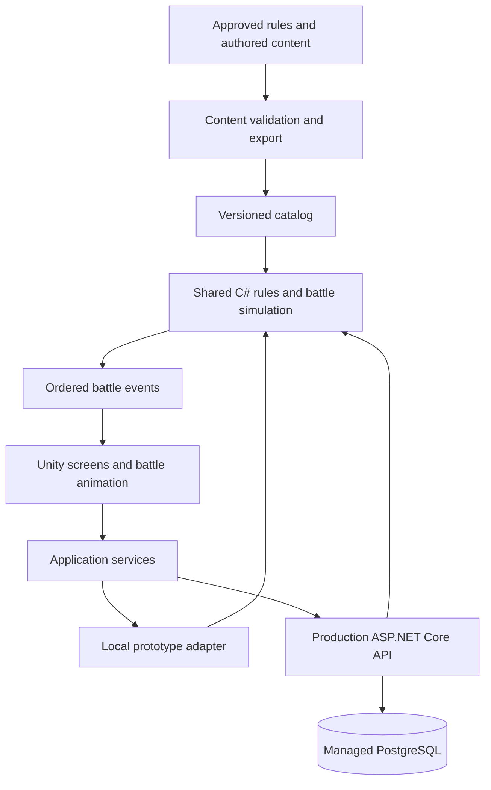

# FunGuy's production path

Repository review: 2026-09-14. Baseline commit: `af63cdc`.

## Recommendation

Continue with Unity 6.3, C#, URP 2D, and Android first. Build a small, polished five-unit PvE formation RPG, prove its combat and progression, then add the authoritative online economy required for the intended commercial gacha game. Preserve useful code and migrate it in small steps.

The next deliverable should be a complete playable slice: start a fresh account, obtain a team, change formation, watch an understandable battle, win rewards, upgrade a unit, and resume correctly after closing the app. More menu scaffolding or a large roster import would not resolve the current risks.

Confirmed product choices: landscape play, twelve hex spaces per side with up to five fighters, automatic basic attacks and player-controlled signature skills with an Auto toggle. Formation and signature timing are player decisions. Build the command/event boundary before presentation so replay and future server validation can include player input. Continue with 2D illustrated units, one campaign and Android first.

## Standing execution requirements

### Current completion outlook — after the full-board correction

The project is an early playable prototype. Local onboarding, summoning, campaign claims, save recovery, canonical stat/evolution/biome calculations, the twelve-space board, interactive combat sessions, landscape event playback and gold-to-level upgrades are implemented. The current content layer imports Garrett's 71-character roster and uses those same roster definitions for the seven-stage campaign, with universal placeholder battle visuals and temporary shared executable skills until selected bespoke kits are implemented. See SLICE_CONTENT.md. Current runtime validation must be re-established after this content transition; final art and human slice pacing remain unfinished.

Remaining order after landscape presentation: deliver a small authored roster/campaign/boss and one upgrade loop; complete levels/evolution/equipment/Core and economy balance; implement accounts and server authority for the commercial gacha scope; finish device QA, release packaging and a measured soft launch. Bespoke roster art, animation and audio production continue alongside content. The confirmed contract is twelve spaces/five fighters, landscape, and manual signatures with Auto.

The first completion target remains 15-30 minutes of coherent Android play with 8-10 complete characters, 5-10 stages, a boss, summoning, upgrades and restart persistence. A commercial release additionally needs secure accounts/economy/purchases, operations, broader device validation and polished launch content. Guilds, raids, PvP and additional platforms remain follow-on scope. No completion percentage or new delivery date is established by the current test counts.

### Sequential execution status

The user requested proceeding through the build order one item at a time. Items **1: gameplay contract**, **2: combat foundation** and **3: landscape battle presentation** are complete. Step 3 passed 109/109 EditMode and 5/5 PlayMode tests, rendered layout review, a non-development Android build and emulator touch/persistence checks. The emulator had system-service startup stalls, so physical-device performance/stability remains a release gate; see PROJECT_LOG.md for precise limits. **4: authored roster, campaign/boss and one upgrade loop remains active for runtime revalidation, bespoke kits, human pacing and content polish**. The upgrade operation, 71-character Garrett roster import, roster-backed seven-stage campaign and first-upgrade guidance are implemented. Historical native Android checks cover the earlier ten-character campaign and must not be treated as current post-import validation. Human discoverability/pacing and bespoke art/audio remain unfinished; items 5-7 remain pending. This sequence is separate from the older milestone numbering below.

**Item 2 delivered scope:** BATTLE_SESSION.md defines action sessions, queued signatures/Auto, immutable events and CampaignSession Begin/Step/AdvanceWave/Complete. Campaign settlement merges the latest save and grants first clear once. COMBAT_EFFECTS.md defines distinct DoTs, controls, immunity/cleanse, cover/movement, bounded passives, five biome/six class bonus families, fourteen representative role pairs and five named canonical-profile encounter examples. Versioned source/tuning decisions and strict content checks accompany the implementation. Full roster authoring, ten remaining kit-specific role pairs, Core/equipment and campaign balance stay in their content/progression steps.

**Item 3 delivered scope:** BATTLE_PRESENTATION.md defines the reusable battle/fighter prefabs, event-snapshot playback, manual signature/Auto controls, pause/speed/focus handling, inspection, reduced motion and safe reward settlement. All 24 spaces are visible; occupied slots show fighter HP/energy/statuses and movement/attack/hit/defeat feedback. Landscape safe-area fitting also covers menus and onboarding. The generated kitchen backdrop is separate from code-native portraits, controls and board geometry. Unique character illustrations, skill-specific animation/audio and additional environments remain authored-content/polish work; this step does not claim final launch art. See the [editor board capture](docs/references/battle-landscape-step3.png) and PROJECT_LOG.md for actual validation.

**Item 4 first increment (historical):** Team gained a fighter upgrade workshop with shared-stat previews and an atomic gold-to-level application operation. slice-levels-v1 records explicit draft costs and a level-20 purchase cap separately from the canonical evolution caps. Existing IDs, summon pools, saved levels/stars and first-clear policy remained intact. The PDF's named structured roster covers Tanks; non-Tank class templates do not constitute complete named kits. This upgrade-only increment passed 117/117 EditMode and 7/7 PlayMode, including save reload/battle integration and landscape render review, without building a new APK. The content increment below supersedes that scope. LEVEL_PROGRESSION.md records the operation and migration boundary; PROJECT_LOG.md records actual validation.

**Item 4 content increment (2026-09-15):** The ten existing identities now have distinct draft basics/signatures/passives covering six classes and five biomes. Explicit authored bases use canonical class growth/evolution through class-growth-v1. Home → Campaign exposes seven authored stages, unlocks, practice rewards and the Cauldron Keeper boss. Valid save IDs/progression, summon buckets/pity and old first-clear claims remain. Final validation passed 122/122 EditMode and 8/8 PlayMode, phone/tablet render review and a fresh non-development ARM64 APK build. The earned-gold three-starter route beat all seven stages across 20 seeds, while an unupgraded team lost the boss 20/20. Consult PROJECT_LOG.md for the exact APK hash and coverage. Guided first-upgrade polish, human pacing, bespoke character/skill art/audio and integrated Android playtesting remain step-4/polish gates; do not call the full 15–30 minute slice complete from simulation alone.

User direction recorded on 2026-09-14: implement the full production-path architecture as development progresses to avoid unnecessary backtracking, and document every change, finding and related decision.

**Item 4 guidance and native acceptance increment (2026-09-15):** First-battle onboarding now takes the player to the Team workshop and explains costs, previews, saving and practice rewards. Tutorial IDs and completed saves remain compatible, and purchasing is optional. This supersedes missing guidance/native acceptance in the historical content increment above. The updated flow passed 9/9 PlayMode tests and a fresh non-development ARM64 APK build. On emulator-5584, an agent-operated fresh-account route cleared all seven stages with the three guaranteed starters and earned upgrades to level 9. Manual queue/Auto, two relaunches, practice without repeated rewards, preserved formation and phone/tablet-sized kit scrolling passed. Final saved wallet: 890 gold / 192 spores. Human pacing/discoverability and physical-device performance are unverified; Auto/Finish and a software emulator do not establish those gates. See PROJECT_LOG.md and SLICE_CONTENT.md for exact evidence and remaining work.

The target architecture below applies from the first stabilization milestone onward. Milestones stage feature delivery; they do not postpone architectural responsibility. Every feature must be placed in its intended layer with the appropriate application contracts, stable IDs, data validation, persistence/migration strategy and eventual server-authority boundary. Introduce these foundations when the relevant system is first built, and evolve existing code incrementally toward them.

For example, the playable slice can use local storage and local simulation, but UI should call application operations and consume battle events rather than own wallet mutations or combat calculations. The later backend should replace infrastructure adapters and enforce authority without requiring a new game loop or UI rewrite. Later infrastructure and features remain deferred until their milestones; production alignment does not require speculative implementation.

Before changing a schema or interface, review downstream milestones and consumers. Avoid shortcuts with predictable replacement costs. If a temporary solution or architectural backtrack is necessary, record the evidence, tradeoff, affected systems, replacement trigger and migration plan in `PROJECT_LOG.md`, and revise this plan when the intended path changes. This requirement supports informed implementation, not repeated approval requests for routine work.

Documentation is a completion gate for every work batch, including read-only investigations. Record changes, findings, decisions, validations, blockers and next steps as they arise. Keep living instructions synchronized with implementation in the same change set; preserve historical audits as dated evidence. See `AGENTS.md` for repository-wide instructions and `PROJECT_LOG.md` for the continuing record.

## What was reviewed

This section and the initial readiness findings describe the baseline audit. Current implementation and verification are recorded in `PROJECT_LOG.md`; current application contracts, schema migration and build commands are in `BUILD_GUIDE.md`. Do not treat an initial finding as unresolved after a later verified fix.

The repository contains 618 tracked files at the baseline. Reviewed the first-party scripts, all four gameplay JSON files, tests, scene structure and references, project/package/build configuration, project notes, stat-sheet PDF, artwork, Git setup, and the role of generated and vendor folders. Third-party TextMesh Pro samples and generated build/cache files were inventoried rather than treated as game implementation.

| Location | Finding | Production treatment |
| --- | --- | --- |
| `Project_context.txt` | Vision, Android-first workflow, and explicit stat-sheet precedence | Keep as historical context; use this plan for execution |
| `Funguy_s Stat sheet.pdf` | 16-page design export with rules, examples, partial roster tables, synergies, equipment and Core costs | Preserve; transcribe approved rules into versioned data and executable examples |
| `FunGuy's/` | Actual Unity project; editor pinned to 6000.3.2f1 | Keep this path during stabilization |
| Root `Assets/` | Empty nested directory scaffold, not another functioning project | Remove only as routine cleanup once verified unused |
| `Assets/_Game/Scripts` inside Unity | 26 first-party C# scripts; static services, simulator, UI, saves, tutorial | Refactor incrementally |
| `Assets/_Game/Tests` | Three test files containing six EditMode tests | Retain and expand around concrete failures |
| `Assets/_Game/Resources/GameData` | 10 placeholder collectible units, 3 enemies, 6 skills, 5 stages, 2 banners | Replace through a validated content pipeline |
| `Assets/Scenes` | Seven gameplay scenes; several contain only a camera or other minimal object | Build explicit, reviewable scene/prefab assets |
| `Assets/Boot.unity` | Additional Boot scene outside the enabled scene path | Consolidate after reference verification |
| `Assets/Art` | One custom home-screen image with baked-in logo and buttons | Use as art direction; separate production background, logo and controls |
| `Assets/TextMesh Pro` | Fonts, shaders, resources and many Examples & Extras assets | Keep required runtime assets; remove unused examples after reference audit |
| `Packages`, `ProjectSettings` | URP 2D, Input System, IAP, tests, preview AI packages, Android profile | Audit dependencies and pin the tested toolchain |
| `Builds`, `Library`, `Logs`, `UserSettings` | Local artifacts and Unity-generated state; an initial APK exists | Keep generated output out of source control; old APK is not evidence for current source |
| `.gitattributes`, nested `.gitignore` | LFS patterns and Unity exclusions exist | Add a root contribution/build guide and root IDE exclusions; verify LFS hydration in CI |

No backend, CI workflow, first-party battle animations, audio library, or reusable game prefabs were found. Existing prefabs are TextMesh Pro samples. The package manifest includes purchasing, but no first-party purchase flow was found.

## Readiness assessment

This is an early technical prototype with useful components, not yet a production-ready game loop.

| System | Present | Missing or unreliable |
| --- | --- | --- |
| Boot and navigation | Data/save/service initialization; seven enabled scenes, Boot first | Clear loading failures; one persistent application root; scene lifecycle verification |
| Combat | Speed gauge, energy, cooldowns, seeded RNG, four effect types, biome damage modifiers | Formation positions, event playback, passives, most statuses, synergies, reliable status lifecycle |
| Content | JSON definitions and lookup maps | Stat-sheet roster, schemas, strict validation, import tooling, content versions |
| Summoning | Single/ten-pull loop, soft/hard pity, featured guarantee, history, duplicate counts | Atomic transaction, disclosed rules/rates, cross-banner policy, durable server ownership |
| Progression | Saved level, stars, XP, gear slots, Core level and currencies | Level-up service, evolution costs, stat derivation, equipment inventory, Core effects, campaign unlocks |
| Save | PlayerPrefs JSON, legacy loading and duplicate backup key | Genuine previous-good backup, robust validation/migration, account restore and transaction safety |
| UI and tutorial | Runtime-generated panels, controller binding, tutorial steps | Authored UI, reliable lifetime/binding, accessible text, roster browsing, usable settings |
| Release | Android IL2CPP/ARM64 settings and local APK precedent | Reproducible current build, AAB profile, signing process, CI, physical-device testing |

## Fix these before adding scope

These findings come from source inspection unless explicitly identified as test results in `AUDIT_VALIDATION.md`.

1. **Stage deserialization is a critical risk.** `Data/Models.cs` stores waves as `List<List<WaveUnit>>`; `JsonLoader` uses `JsonUtility`. Unity does not support nested container serialization. Change to `List<WaveDef>` where each wave owns a list of enemies, migrate the JSON, and run the existing resource-loading test. Do not silently substitute empty stages. [Unity serialization rules](https://docs.unity3d.com/6000.3/Documentation/Manual/script-serialization-rules.html).
2. **Establish reproducible compilation and tests.** Compilation succeeded with the installed Unity 6000.3.2f1 environment during this audit. Five tests passed; the stage-resource test failed because `s_1_1.waves` was null. The runtime asmdef declares no explicit assembly references; retain the working dependency graph and validate it from a clean CI checkout rather than making speculative dependency changes.
3. **Combat status handling can produce incorrect outcomes.** In `Battle/BattleSim.cs`, a unit killed by start-of-turn damage is not checked again before acting; one-turn Silence expires before skill selection; stacking increments both potency and stack count and multiplies them again during ticking. Two identical stacks can therefore produce four times one-stack damage. Burn and Bleed currently tick like Poison; the PDF describes different mechanics. Thorns is applied by a shipped skill but has no reflection implementation.
4. **Initialization and binding need a single owner.** `RuntimeSceneUiBootstrap` adds components before assigning fields, repeatedly reparents controllers, and sometimes calls `SetParent` with the controller's own transform. `TutorialManager.Awake` requests persistence while the dynamically created manager is under the Canvas. Validate persistence and overlay rebinding across every scene transition. The generic binder can add duplicate listeners on repeat binding; reveal buttons depend on initialization order. Replace these patterns with explicit initialization and serialized references.
5. **The current economy is unrestricted.** Battle wins repeatedly award the same currency; there is no saved unlock or first-clear state. `accountXp` is added directly to `accountLevel`. Enemy levels do not affect battle stats because the production converter supplies zero growth, while the smoke-test converter uses growth. Use shared stat and reward services.
6. **Summoning is not transactional.** Currency and pity mutate before character selection can fail. Ten-pulls are a loop of partial successes; a tutorial ticket is consumed before a successful pull. Preflight eligibility and cost, calculate a complete result, then commit once. Define all-or-nothing ten-pulls. Use an explicit banner-family key if pity/featured guarantees should transfer to replacement banners; current keys are per banner ID.
7. **Tutorial awards are not idempotent.** Re-entering the reward step grants currency again; startup can replenish the tutorial ticket. Persist claim flags and resume steps without repeating rewards.
8. **Debug powers are exposed through normal navigation.** `EnsureOptionsScene` creates resource grants, roster seeding, save reset and tutorial skipping without a development guard. Separate QA tooling from the shipping assembly and build real audio, accessibility and account settings.
9. **Save recovery needs redesign.** Both primary and backup keys are overwritten with the same new JSON, so the backup is not the previous known-good save. `DeleteSave` leaves legacy keys available for later recovery. Validate versions, bounds, IDs, null entries, team membership and collections; test corruption, downgrade and interruption explicitly.
10. **UI currently mixes incompatible approaches.** Home contains TextMesh Pro objects; controllers and runtime builders primarily expect `UnityEngine.UI.Text`. Runtime screens use fixed portrait dimensions, while the supplied artwork is landscape and contains baked controls. Standardize on prefab-based uGUI plus TextMesh Pro, a shared safe-area layout and the Input System UI module. The runtime fallback currently creates the legacy input module.

## Resolve the design contract

**Current formation correction (2026-09-14):** The user's [full-board reference](docs/references/full-board-reference.png) supersedes the two-front/three-back restriction. `FORMATION_RULES.md` separates the five-fighter cap from twelve hex spaces per side, with three depths, four lanes and schema-5 migration. Team offers any friendly hex; Battle previews deployments then plays live event snapshots. The user confirmed twelve spaces/five fighters in step 1. Depth targeting, adjacency/cover/displacement and representative biome/class/role synergies are implemented and documented in COMBAT_EFFECTS.md. Earlier five-slot APK results below do not validate this correction; see the latest PROJECT_LOG entry.

**Current stat implementation (updated 2026-09-15):** `COMBAT_RULES.md` and versioned `stat_rules.json` define canonical unequipped stat/evolution and biome-damage rules. They supersede the initial proposals below for level indexing, SPD and biome-less behavior. Six class tables and 14 named Tank stat rows are implemented as references. Named examples use explicit stat-profile IDs; the current 71 collectible identities use Garrett-authored base stats with canonical class growth through class-growth-v1. R fighters are biome-less and the imported SR/UR/Kitchen/Cosmic values are preserved from the roster source. SLICE_CONTENT.md distinguishes source rules from authored decisions. Equipment/Core remain later progression work; formation and representative synergy semantics are defined in FORMATION_RULES.md and COMBAT_EFFECTS.md. Consult PROJECT_LOG.md for executed tests rather than treating implementation as release verification.

The stat sheet takes precedence over the context file, but its own tables and prose disagree. It also contains copied draft commentary and does not provide a clean, complete production roster. Never fill missing kits by guessing and label them canonical.

| Decision | Evidence and recommended resolution |
| --- | --- |
| Biomes | Use Forest -> Wetlands -> Decay -> Tundra -> Forest, with Kitchen neutral. Preserve +50% damage on advantage and 25% reduction on the reverse matchup. Remove legacy element-to-biome substitutions from new content. Define biome-less R units explicitly. |
| Damage constant | Use C=3000 from the revised rules. Correct the explanatory prose: increasing C in C/(C+DEF) increases damage at fixed DEF; it does not lengthen fights. At DEF=3000, C=2000 gives 40% raw damage and C=3000 gives 50%. Balance with measured battle duration. |
| Level indexing | Recommend base + growth * (level - 1), making level-one values match the base table. Several PDF worked examples use different indexing; approve reference cases before importing all content. |
| Stars versus rarity | Separate R/SR/UR acquisition rarity from 1-6 evolution stars. Existing rarity values 3/4/5/6 and rarity-star UI blur the two. Require an explicit migration. |
| Speed | Keep the PDF's flat star-speed concept and avoid multiplying SPD by the normal star multiplier. Resolve whether the base includes level growth and whether one star adds +15 or +0 before implementation. |
| Equipment | PDF formula uses growth * level while its level-one sequence starts at base; stated endpoints also disagree. Recommend explicit level tables for every slot/rarity, with level-one and maximum examples checked by design. |
| Class affinities | Text describes multiplying gear-derived benefits; examples multiply the total stat. Decide the order once and centralize it in `StatCalculator`. |
| Gauge and energy | battle-actions-v1 follows the PDF's reset-to-zero gauge. BATTLE_SESSION.md defines start-turn and per-hit energy, skipped-turn cooldowns and accepted command timing. The earlier overflow-retention proposal was not adopted. |
| Effects and synergies | Specify duration owner, tick timing, stacks/caps, cleanse/immune rules, targeting precedence and trigger order. Decide highest-tier versus cumulative biome bonuses, role-pair scope, and whether dead partners disable effects. |
| Core progression | Use the ten-level path and milestones at 4/7/10. Define locked Core level 0 and eligible rarities; current code gives every new unit Core level 1 for free despite an unlock cost in the PDF. |
| Formation | User confirmed twelve hex spaces per side and up to five fighters, with landscape presentation and manual signatures plus Auto. FORMATION_RULES.md defines current depth targeting; specify adjacency, cover and movement before dependent kits. |

Output of this milestone: `COMBAT_RULES.md`, the maintained `RULE_DECISIONS.md` register, machine-readable definitions and independently calculated fixtures for at least one Tank, DPS, Support and Assassin at multiple progression levels. Garrett owns kit/art decisions with the product owner; engineering owns consistency and executable validation.

## Target architecture

Keep UI, game rules and storage separate. Start with ordinary C# classes and explicit dependencies; a large framework, ECS rewrite or microservice fleet is unnecessary for this scope.

| Layer | Responsibility |
| --- | --- |
| Domain | IDs, immutable content, formation, stat calculator, targeting, status/passive triggers, battle events, progression and reward rules |
| Application | Summon, upgrade, select formation, start battle, claim reward, resume tutorial; each validates and commits one operation |
| Unity presentation | Prefabs, screen controllers, animations, input, sound and accessibility; it displays outcomes rather than awarding currency |
| Infrastructure | JSON loading, local save adapter, backend client, telemetry and platform purchase adapter |
| Editor tooling | Content validator/importer, prefab validation, deterministic battle harness, build entry points |

Extract Unity-dependent loading from `GameData` so the simulator consumes a plain catalog. Use a shared C# library compatible with Unity and the server; verify the chosen .NET Standard target with both toolchains. Cross-platform libraries are the supported way to share this logic. [Microsoft library guidance](https://learn.microsoft.com/en-us/dotnet/standard/library-guidance/cross-platform-targeting).

Change `RunBattle` into a step-capable simulation that returns explicit victory/defeat/timeout and ordered events: action started, energy changed, skill used, damage, status, death, wave complete. Give every combat instance a unique ID, including identical enemy types. Use stable sorting, a specified RNG and rounding rules; equal seeds in one runtime alone do not prove cross-platform determinism. Play animations from events. Test playback skips and speed changes against identical final results.

For content, retain bundled JSON for the slice with a supported schema. Require unique IDs, valid references, known effect handlers, legal values and banner pool/rate checks. Add ScriptableObject presentation mappings for portraits, sprites, VFX and audio. Introduce downloadable asset catalogs only when content size or update cadence justifies them.

For the commercial backend, recommend one ASP.NET Core API with managed PostgreSQL and object storage/CDN for versioned assets. This keeps authoritative rules in the project's existing language. Hosting vendor and spend are selected during the backend milestone after expected concurrency, region and budget are known; no deployment or paid services are needed now.

The server owns wallet balances, inventory, pity, upgrades, reward claims, purchases and account state. Each economic operation needs authentication, an idempotency key, atomic database updates, a ledger entry and concurrency protection. Production pulls use server-side secure randomness. For automatic PvE, create a battle record from server-owned formation/content/seed, run or verify the shared simulator, and award its result once. Never trust a client `won=true` flag. Bound repeated battle requests and attempts to reroll outcomes.

Local offline testing remains useful; production offline play should be limited to practice unless a separate reconciliation design is implemented. Local prototype saves should not be imported as trusted premium balances. Provide account linking/recovery, catalog compatibility checks, maintenance behavior and reconnect/resume before monetization.

## Milestones and completion gates

Effort ranges are preliminary engineering estimates for one experienced engineer with continuing design/art availability. They exclude waiting for art, contractor onboarding and store review. Re-estimate after the playable slice; calendar time for a small team is likely 6-12+ months for the proposed commercial scope.

| Milestone | Work and deliverable | Exit gate | Engineering estimate |
| --- | --- | --- | --- |
| 0. Reproducible baseline | Fix compile/data blockers; prove Boot-to-battle; guard QA controls; add build/test scripts and rule decision register | Clean checkout compiles; all existing tests execute; stage resources load; development APK boots on a device | 1-2 weeks |
| 1. Combat foundation | Canonical stat calculator, formation, targeting, status lifecycle, passives, battle events and representative synergy pairs | Golden examples pass; several team compositions demonstrably change battle outcomes; no dead actors or runaway trigger loops | 3-5 weeks |
| 2. Playable slice | 8-10 approved units spanning six classes/five biomes, 5-10 stages and a boss; animated combat; team builder; summon; one upgrade path; tutorial; robust local save | New player completes the full loop unaided, upgrades and resumes after force-close; 15-30 minutes of coherent play on Android | 4-6 weeks |
| 3. Production progression | Levels, six-star evolution, four equipment slots/sets, ten Core levels, unlocks and first/repeat rewards; full rules for selected kits | Every resource has a source and sink; XP curves and costs are simulated; migrations and reward re-entry tests pass | 4-6 weeks |
| 4. Online economy | Account recovery, authoritative operations, battle verification, database ledger, purchase validation, telemetry, content versions, operations tools | Retry/concurrency/reconnect tests cannot double-grant; restore drill succeeds; purchases tested in store sandbox; staging separated from production | 4-6 weeks |
| 5. Soft-launch candidate | Expand to roughly 15-20 complete units and 2-3 chapters only as art and balance permit; real settings; polish and performance; signed AAB | Device matrix passes; release contains no cheats; no known save-loss blockers; store listing and operational runbooks ready | 4-6 weeks |
| 6. Soft launch and release | Small audience, funnel/retention/economy review, balance updates, support and recovery practice | Evidence supports onboarding, returning play and stable operations; critical defects resolved before rollout expansion | 4-8 weeks observation and iteration |

The critical path is baseline -> rules -> playable loop -> progression -> authoritative economy -> soft launch. Garrett can develop the visual kit alongside engineering once slice characters and asset specifications are fixed.

Do not make the entire theoretical roster a launch requirement. Guilds, raids, PvP, seasonal infrastructure, cosmetics storefront, PC and iOS are follow-on work after the Android loop and service operation are proven. Preserve data extension points without building those features in advance.

## Art, UX and content production

Use the existing home image's illustrated fungal fantasy as the starting direction. Establish silhouette, biome colors, material treatment, typography, readability and VFX rules. Approve three characters first, then measure production time per character before setting the launch roster.

For every selected unit, require a final design/kit row, portrait, roster icon, combat sprite or rig, idle/attack/signature/hit/death states, skill icons, effects/audio references and import settings. Use reusable 2D rigs or animation templates where they preserve the silhouette. Separate the background/logo from live UI buttons and text. The baked image cannot supply responsive or localized controls.

Ship a scrollable roster with filters and detailed stats; visible front/back placement and active synergy descriptions; a campaign with locked/unlocked states; readable HP, shields, energy and status icons in battle; complete summon cost/rate/pity details; and upgrade previews that match the calculator. Make battle speed, skip and reduced motion predictable. Provide adequate contrast, text scaling, safe areas and icon-plus-text cues for biomes.

Each content change must identify its rules version, character/skill IDs, costs and asset references. Validate in the editor/CI and run representative battle scenarios. Avoid editing production odds or economy numbers without a versioned change record and rollback plan.

## Build, QA and release pipeline

1. Pin Unity and packages initially. Once the baseline works, validate a supported 6.3 patch against Android release needs on a separate branch; do not upgrade every dependency simultaneously. Audit preview AI, multiplayer tooling and sample packages for actual use.
2. Add root setup instructions and explicit project path. CI checks out LFS assets, verifies metadata/references/content, compiles and runs EditMode tests, then PlayMode navigation tests. Keep local caches and build outputs excluded.
3. Create Development, Staging and Production profiles. Development builds retain QA tools; staging exercises backend and store sandbox; production removes test powers and verbose account logs. Add an editor build entry point with fixed scene list, version and environment inputs.
4. Produce APKs for fast local installs and signed AABs for Play delivery. Current profile has `m_BuildAppBundle: 0`; it is not yet the intended store artifact. Archive test XML, build logs/report, symbols, content manifest and commit ID. Keep signing keys and backend secrets outside the repository.
5. Keep IL2CPP/ARM64 and verify native dependencies and stripping in a real release build. Test low/mid/high Android devices, small/tall displays, OS minimum, latest supported OS, 16 KB environment, suspend/resume, interrupted network, low storage, upgrades and long sessions. Emulator boot alone is insufficient.
6. Define initial performance budgets: 30 FPS sustained on the lowest supported test device, 60 FPS option where practical, no recurring battle/UI allocation spikes, and a measured memory/download budget after the art slice. Use these as proposed targets, then record actual profiler captures.
7. Before external launch, require zero known blockers involving save loss, duplicate purchases/rewards, unwinnable onboarding or crashes in the primary loop. Review tutorial completion, first upgrade, stage failures, session duration and D1/D7 retention; choose quantitative release thresholds after a representative pilot rather than inventing evidence now.

As checked on 2026-09-14, new Android phone apps/updates must target API 36 or later under the current Play rule. The project uses automatic target SDK selection; pin and verify the actual release toolchain instead of assuming this setting meets the rule. [Android target requirements](https://developer.android.com/google/play/requirements/target-sdk).

Validate 16 KB page-size support across the final native libraries and test the bundle-generated install. [Android page-size guidance](https://developer.android.com/guide/practices/page-sizes).

If randomized items are sold, display their odds before and near the purchase. Prepare billing, privacy/data declarations, account deletion/recovery, age/territory decisions, customer support and current store requirements before enabling real payments; these remain release tasks, not implemented features. [Google Play developer policy](https://support.google.com/googleplay/android-developer/answer/16313518?hl=en-GB).

Operational completion includes a rehearsed database restore, compatible content rollback, purchase reconciliation, alerts for failures, rate limits, a controlled support adjustment tool with audit history, and a staged-rollout/incident procedure.

## First implementation batch

Milestone 0 implementation started on 2026-09-14. Stage serialization/validation, combat regressions, shared conversion, local campaign/summon/team transaction boundaries, save migration, tutorial lifecycle and development-only QA navigation are implemented. The stabilization source passed 23 EditMode and 3 PlayMode tests; the preceding 19-test baseline also passed after a fresh project import. The subsequent canonical-stat source passed 53 EditMode and 3 PlayMode tests; the formation source now passes 65 EditMode and 4 PlayMode tests. The APK/device results in this paragraph cover the stabilization source and predate canonical-stat integration. Development packaging and the updated non-development IL2CPP/ARM64 APK build succeeded. The updated APK completed Android emulator touch onboarding, team clear/autofill and first battle; release QA controllers are absent. Device screenshots drove roster spacing, battle heading and button contrast fixes. Earlier emulator boot failures are superseded by this successful isolated software-rendered run, which still showed transient Android System UI ANR prompts. Physical-device coverage, performance/16 KB checks and store delivery remain unverified. See `PROJECT_LOG.md` for precise evidence and limits. The stat foundation and first formation model are now implemented; finish representative kits and effect/synergy rules before expanding the roster.

The subsequent canonical-stat and formation APK also built successfully and passed Android emulator touch checks for placement, cross-row swaps, moves, removal, first battle and tutorial completion. Force-stop/relaunch preserved exact positions, deliberate empty slots, currency and tutorial completion. This latest source passed 65 EditMode and 4 PlayMode tests. The emulator again showed a transient System UI ANR at startup; physical-device/performance and store-release gates remain open. See the formation delivery entry in `PROJECT_LOG.md` for the APK hash, screenshots and coverage limits.

The batch follows this order:

1. Record the current successful compilation and 5/6 test result in a repeatable build/test script; verify a clean checkout.
2. Replace nested stage waves with serializable objects and strict resource validation.
3. Correct dead-actor handling, status expiry/stacking, and enemy stat conversion; add focused regression tests for those behaviors.
4. Stabilize application/tutorial lifetime and explicit UI initialization. Prove first summon/reveal, scene changes, restart and first battle.
5. Remove QA powers from release and make tutorial/stage claims idempotent.
6. Produce a development Android build and document the reproducible command/toolchain.

The canonical stat/formation foundation, representative combat engine and landscape presentation have living contracts in COMBAT_RULES.md, FORMATION_RULES.md, BATTLE_SESSION.md, COMBAT_EFFECTS.md and BATTLE_PRESENTATION.md. Step 4's authored roster, campaign/boss, guided upgrade loop and native functional route are delivered; continue with human pacing/discoverability evaluation and content polish. The latest source validation and APK coverage are recorded in PROJECT_LOG.md; historical counts/builds above remain dated evidence only.
